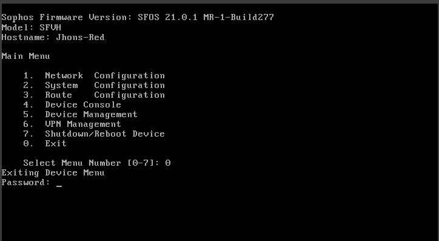
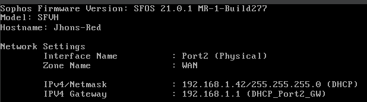
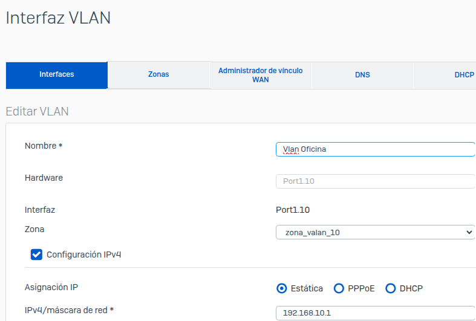
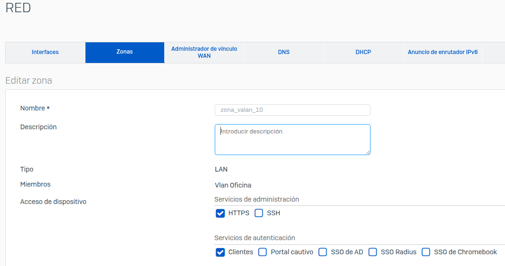
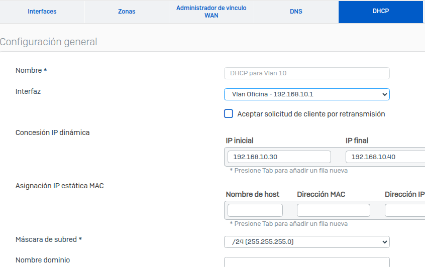
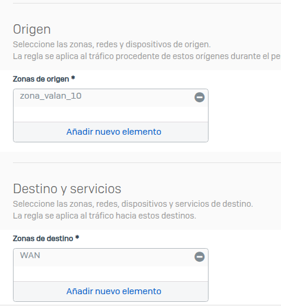
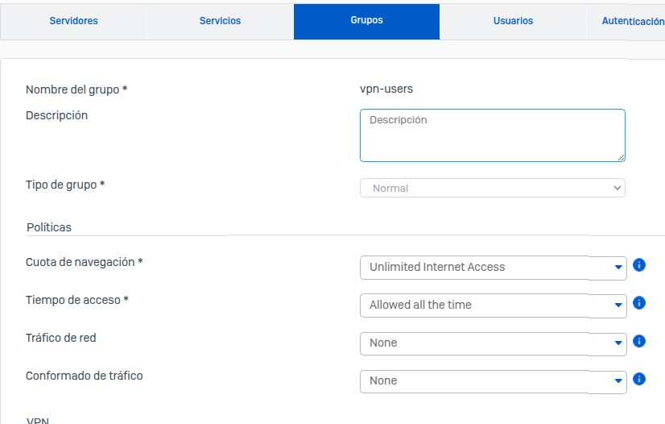

## 🛠️ Herramientas utilizadas

- **VirtualBox**
- **Sophos XG Home Edition** – Firewall virtualizado.
  
---

## 🧩 Objetivos del laboratorio

- Simular un entorno real de red segura.
- Configurar reglas de firewall y control de acceso.
- Habilitar y probar una **VPN SSL** remota.
- Administrar usuarios, grupos y políticas.

---

## 🧪 Proceso de configuración y pruebas

### 🔹 1. Configuración inicial de Sophos
- Instalación de Sophos XG en VM.

<br>
- Asignación de interfaces LAN y WAN.
  <br>



### 2. 🧱 VLANs y Segmentación
- Creación de VLANs en la red LAN para segmentar el tráfico interno.

- Para crear correctamente una VLAN en Sophos, primero se debe crear una zona, ya que la interfaz VLAN debe estar asignada a una zona para su gestión y control de tráfico.
<br>

- Asignacion de DHCP para la Vlan.
<br>

  
### 🔹 3. Políticas y reglas de firewall
- Creación de políticas de firewall entre zonas



### 🔹 4. Configuración de VPN SSL
- Se creó un usuario local y un grupo de usuarios VPN.

- Se asignó al usuario una política de VPN SSL específica.


---

## 🧱 Estructura esperada del laboratorio

```bash
📁 laboratorio-sophos-vpn
├── vpn-config/
│   ├── cliente-vpn.ovpn
│   └── notas-configuracion.md
├── capturas/
│   ├── error-vpn.png
│   └── interfaz-firewall.png
├── README.md
