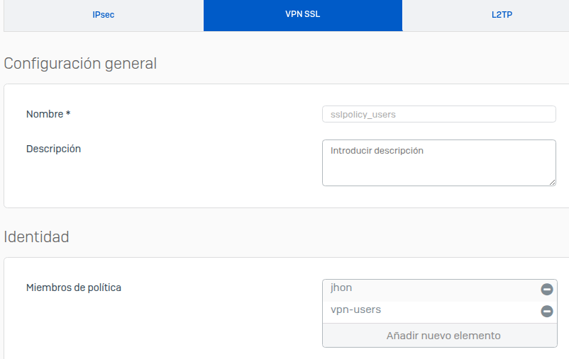
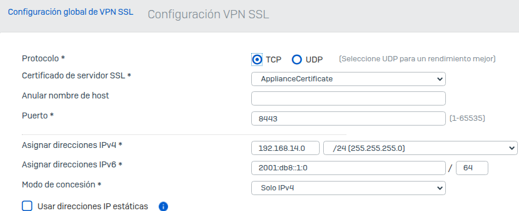
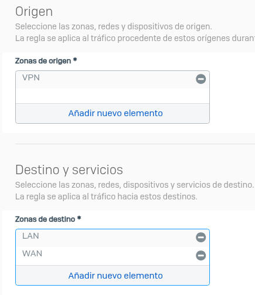
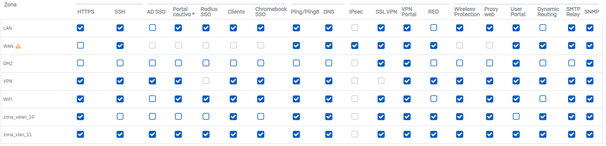
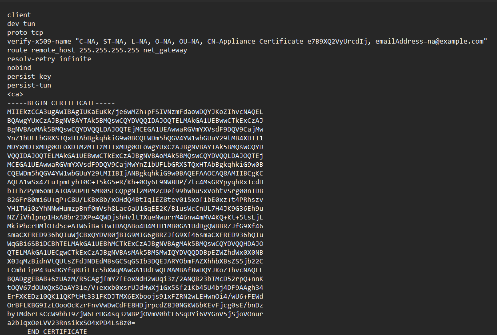

🛠️ Herramientas utilizadas

- **VirtualBox**
- **Sophos XG Home Edition** – Firewall virtualizado.
  
---

## 🧩 Objetivos del laboratorio

- Simular un entorno real de red segura con una o mas VLAN.
- Configurar reglas de firewall y control de acceso.
- Habilitar y probar una **VPN SSL** remota.
- Administrar usuarios, grupos y políticas.

---

## 🧪 Proceso de configuración y pruebas

### 🔹 1. Configuración inicial de Sophos
<ul>
  <li>
    
Instalación de Sophos XG en VM.

    
  </li>

  <li>
    
Asignación de interfaces LAN y WAN.

    
    
  </li>
</ul>

### 2. 🧱 VLANs y Segmentación
<ul>
  <li>
    
Para crear correctamente una VLAN en Sophos, primero se debe crear una zona, ya que la interfaz VLAN debe estar asignada a una zona para su gestión y control de tráfico.

    
  </li>
  <li>
     
Creación de VLANs en la red LAN para segmentar el tráfico interno.

      
  </li>
  <li>
    
Asignacion de DHCP para la Vlan.

    
  </li>
</ul>
  
### 🔹 3. Políticas y reglas de firewall
<ul>
  <li>
    
Es necesario la creación de una regla de firewall para permitir que los usuarios que estan en la VLAN puedan acceder a la WAN (Internet)

  
  </li>
  <li>
 
Para verificar que la VLAN fue creada correctamente y funciona según lo esperado, se utilizará una máquina virtual con Linux. Esto se debe a que sistemas como Windows no soportan el etiquetado VLAN. Es importante que esta máquina virtual esté conectada a la misma red interna que el firewall (por ejemplo, mediante un adaptador de red en modo "Red Interna") para poder ejecutar los comandos necesarios y comprobar la conectividad dentro del entorno VLAN.

Para esto ejecutamos los comandos:

sudo ip link add link enp0s8 name enp0s8.10 type vlan id 10 (crear la interfaz VLAN 10 sobre enp0s8)

sudo ip link set dev enp0s8.10 up (levantar la interfaz VLAN)
 
<b>Ejecutamos:</b>

Podemos ver que nuestra MV esta recibiendo la primera ip del rango que he asignado y que tambien tiene conexión a Internet

  </li>
</ul>

### 🔹 4. Creacion y configuracion de una VPN 
<ul>
  <li>

Para implementar correctamente una VPN, es fundamental la creación de una política de acceso VPN, la cual define los permisos, recursos accesibles y usuarios autorizados para establecer conexiones remotas seguras con la red interna.

    
  </li>
    <li>

Tambien es necesario realizar la configuracion global de la VPN, que es donde se define el protocolo que se usará (en este caso TCP), los certificados,el puerto por el cual se escuchara la VPN, y tambien el pool de direcciones IPV4 que se le asignará a cada usuario cuando se conecte a la VPN

    
  </li>
  <li>  
        
Acontinuación se procede a definir qué usuarios tendrán acceso a la VPN. Por ende, se debe crear un grupo de usuarios específico al cual se le asignará la política VPN creada anteriormente. Esto permite gestionar de forma centralizada los accesos y facilitar la administración de los usuarios conectados.

    
  </li>
  <li>
  
Acontinuación se creó una regla de firewall que permite a los usuarios conectados por VPN acceder tanto a la red interna (LAN) como a Internet (WAN).

    
  </li>
   <li>
  
Se habilitaron los accesos necesarios para que las diferentes zonas (como WAN o VPN) puedan interactuar con el firewall. Esto incluye el acceso al portal SSL VPN, la capacidad de realizar pings, acceder a la gestión remota, y otros servicios esenciales desde fuera de la red local.

    
  </li>
  <li>
    
Se generó el archivo de configuración .ovpn para importar al cliente Sophos Connect.

    
  </li>
  <li>
    
Se descargó e instaló el cliente VPN en el equipo host.

    
  </li>
  <li>
    
Se importó el archivo .ovpn al cliente para establecer la conexión y se probó la VPN correctamente para  acceder a la red interna y navegar por internet.

    
  </li>
</ul>

